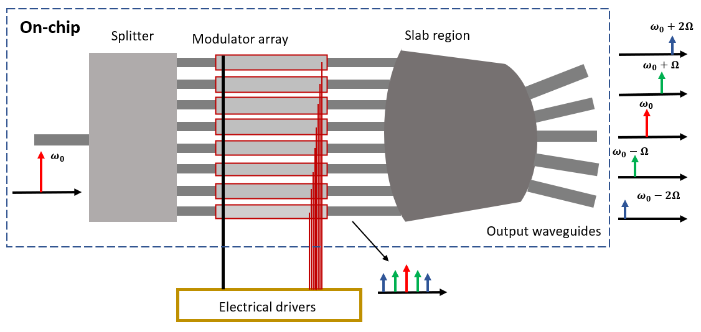

# multibeam frequency shifter
multibeam frequency shifter  - [link to the paper](https://doi.org/10.1364/OE.498792)

A shematic of the multibeam frequency shifter:

This directory shows how one can create and simulate a multibeam frequency shifter using gdsfactory. The notebook creates a 16-by-5 star coupler using gdsfactory and sets up 2d fdtd simulations using tidy3d.
By changing the source port, multiple simulations can be combined to create the s matrix of the star coupler. The resulting simulation output is stored in the data folder. With these s parameters, the performance of the star coupler can be estimated. Now assuming an array of modulators attached to the star coupler, that is driven in 'wavelike -fashion' (more details in the paper), we can estimate the performance of the multibeam frequency shifter.
[View My Notebook output](https://edieussa.github.io/multibeam_fshifter/multibeam_fshifter.html)

(Below,a cool image of the simulation of the star coupler with the source)
[simulation_image](https://github.com/edieussa/multibeam_fshifter/images/simulation_image.png)
